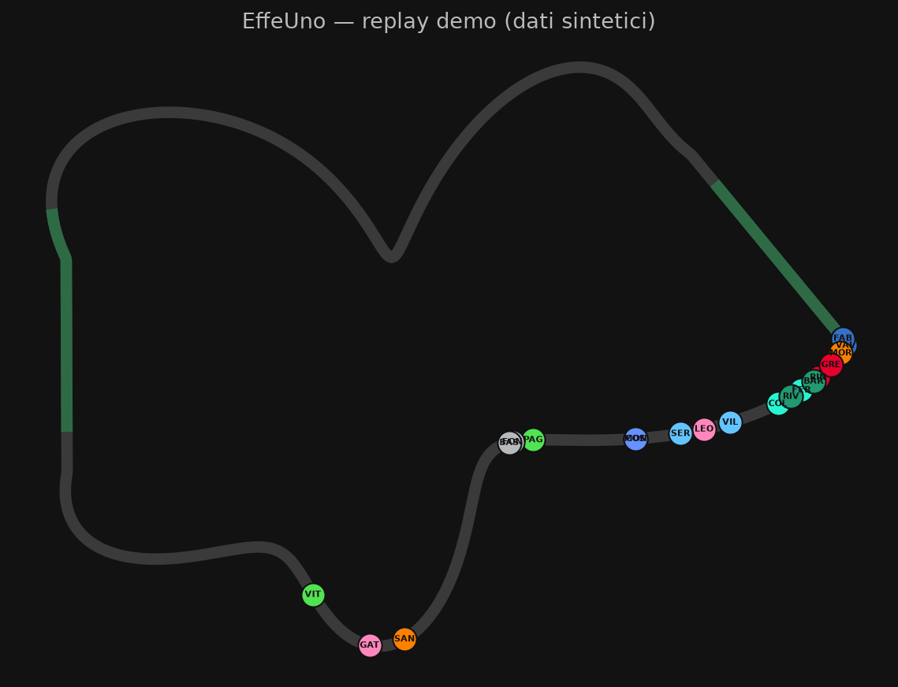

# EffeUno

Interactive F1 telemetry replay, built on [FastF1](https://docs.fastf1.dev/).
Load any race since 2018 and watch it unfold on an animated track map,
reconstructed from real positional telemetry — leaderboard with live gaps and
sector blocks, race-control and team-radio feed, weather, and a full set of
engineering charts.



**[▶ Live demo](https://proivonz001.github.io/EffeUno/)** — runs entirely in
your browser on a **synthetic race** (fictional drivers, teams and circuit,
generated by `scripts/gen_demo_data.py`). No F1 data is hosted or
redistributed; to watch real sessions, run the app locally (below).

## Features

- **Animated replay** — canvas track map from ~3.8 Hz positional telemetry
  with interpolation, zoom/pan, playback up to 30×; checkered finish line,
  sector boundaries, data-derived DRS zones and detection points, local
  yellow marshal sectors, pit lane, wind compass.
- **Live-timing style leaderboard** — gaps and intervals (frozen correctly at
  the flag), TV-convention sector blocks, last/best lap, tyre wheel + age,
  pit count with durations, track-limit strikes, penalties, overtake/DRS
  indicator.
- **Race control + team radio feed** — synced to replay time, with playable
  radio clips (real sessions) and per-driver focus filtering.
- **Charts** — race pace box plot, average gap, tyre strategies, stint
  degradation with regression, pit times by team, top speeds, lap chart,
  per-lap gaps between any drivers.
- **Lap comparison** — up to three laps overlaid: speed / throttle / brake
  traces and cumulative time delta by distance.
- **Sessions** — race, sprint and qualifying (qualifying sorts by best lap).

## How it works

```
React (Vite) ──HTTP/JSON──> FastAPI ──> FastF1 (+ local disk cache)
```

- **`backend/`** — FastAPI wrapping FastF1 behind an abstract `DataSource`
  interface (a live-timing source can slot in without a rewrite — see
  [docs/LIVE-PLAN.md](docs/LIVE-PLAN.md)). Sessions load in a background
  thread; the API reports `loading`/`ready` so the browser never blocks.
- **`frontend/`** — React + Vite + TypeScript. All standings, charts and the
  feed are computed client-side from a single replay payload.
- **`scripts/`** — data exploration (Fase 0), the synthetic-race generator
  for the public demo, and the live-timing recording kit.

F1 data is **never** stored in this repository. Each user downloads it
locally through FastF1, which caches it on disk (`fastf1_cache/`, gitignored).

## Running locally (real data)

Requirements: Python ≥ 3.10, Node ≥ 20.

```bash
# backend
python -m venv .venv
.venv/Scripts/pip install -r backend/requirements.txt   # (bin/ on Linux/macOS)
.venv/Scripts/python -m uvicorn backend.app.main:app --port 8000

# frontend (second terminal)
cd frontend
npm install
npm run dev
```

Open http://localhost:5173, pick a season, race and session, hit *Carica*.
The first load of a session downloads ~85 MB through FastF1 and takes a
while; cached reloads take seconds.

## Notice

EffeUno is an unofficial project and is in no way associated with the
Formula 1 companies. F1, FORMULA ONE, FORMULA 1, FIA FORMULA ONE WORLD
CHAMPIONSHIP, GRAND PRIX and related marks are trade marks of Formula One
Licensing B.V.

This project is non-commercial. It does not redistribute F1 data: all data is
fetched and cached locally by each user via FastF1, and the public demo uses
computer-generated synthetic data only. Team colors in the UI are an
approximated custom palette, not official assets.

## License

Code released under the MIT License.
